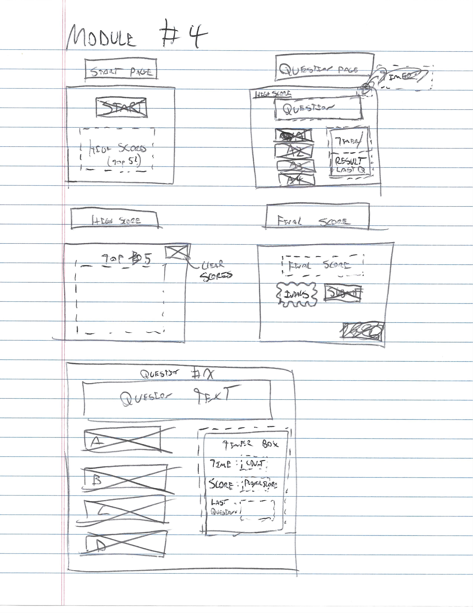

<h2 align="center">Interactive Code Quiz</h2>

---

<h5 align="center">

🯠Module 4 Challenge 🯠
By Clayton Skaggs 
(WW21.2) / May 24th 2022

Version 0.2</h5>

---

 
 
 
 

<h3 align="center">🧙‍♂️ 🧙‍♂️ User Story 🧙‍♂️ 🧙‍♂️</h3>

----

<b>AS AN</b> coding boot camp student 
<b>I WANT</b> to take a timed quiz on JavaScript fundamentals that stores high scores 
<b>SO THAT</b> I can gauge my progress compared to my peers

 
 
 

<h3 align="center">🌟 🌟 Acceptance Criteria 🌟 🌟</h3>

---

 <b>GIVEN</b> I am taking a code quiz   

<b>WHEN</b> I click the start button 
✔️ THEN a timer starts and I am presented with a question 
<b>WHEN</b> I answer a question 
✔️ THEN I am presented with another question 
<b>WHEN</b> I answer a question incorrectly 
✔️ THEN time is subtracted from the clock 
<b>WHEN</b> all questions are answered or the timer reaches 0 
✔️ THEN the game is over 
<b>WHEN</b> the game is over 
✔️ THEN I can save my initials and score 
 
 
 

<h3 align="center">⚡ ⚡ Features ⚡ ⚡</h3>

---

<ul>
  <li>⚡ Asks you questions to test your JavaScript knowledge.</li>
  <li>💥 Tracks your score to let you know how well your are doing.</li>
  <li>⚡ At the conclusion of the game user can submit their score to the leaderboard.</li>
  <li>💥 Leaderboard can be viewed before or after the game.</li>
  <li>⚡ Leaderboard data can be reset.</li>
</ul>

 
 

<h3 align="center">📐 📐 Mock Up / Protype 📐 📐</h3>

---

  

 
 

<h3 align="center">🎭 🎭 App Demo 🎭 🎭</h3>

---

  

 
 
 
 

<h3 align="center">📡 📡 Deployment Information 📡 📡</h3>

---

🚀 <a href="https://github.com/DesertCow/Module4-Challenge_Skaggs">github.com/DesertCow/Module4-Challenge_Skaggs</a> 🚀
 
 
🛰️ <a href="https://desertcow.github.io/Module4-Challenge_Skaggs">desertcow.github.io/Module4-Challenge_Skaggs/</a> 🛰️

---

 
 